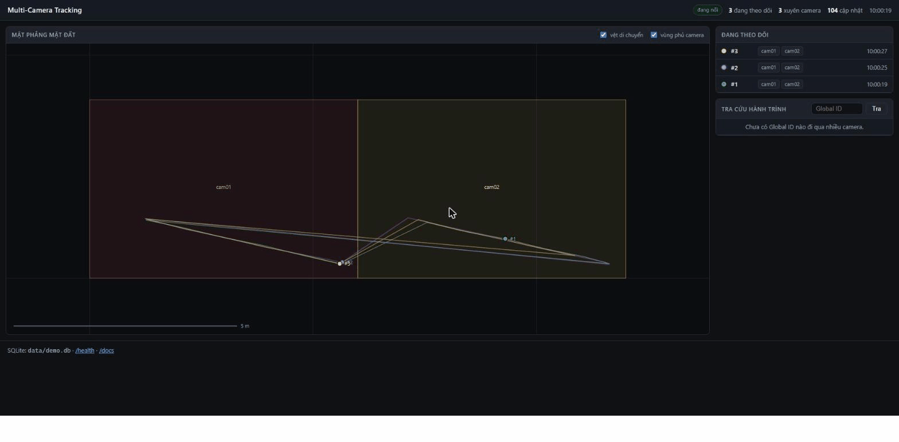
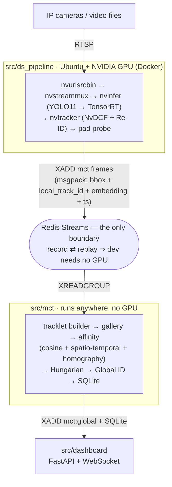

# Multi-Camera People Tracking on NVIDIA DeepStream

**MTMCT** (Multi-Target Multi-Camera Tracking): follow people across 3–4 IP cameras and assign a
**consistent Global ID** as they move from one camera to the next — for camera pairs with
overlapping fields of view *and* pairs with none.

<p align="center">
  
  <br><em>Live dashboard — ground-plane map with camera footprints, live positions and per-Global-ID
  trajectory trails. Three identities, each seen in both cameras, each holding a single Global ID
  across the hand-off. (Replayed metadata; see <a href="#demo">Demo</a>.)</em>
</p>

> Graduation thesis project. Every technical decision is written up with its rationale in
> [`docs/worklog/`](docs/worklog/); every number in this README is reproducible from a recorded
> fixture with no GPU required.

---

## Contents

- [What this is](#what-this-is)
- [Architecture](#architecture)
- [Results](#results)
- [Demo](#demo)
- [Quickstart](#quickstart-no-gpu-no-cameras)
- [The multi-camera association engine](#the-multi-camera-association-engine)
- [Repository layout](#repository-layout)
- [Engineering notes](#engineering-notes)

---

## What this is

A three-tier system, decoupled through **Redis Streams**:

1. **`src/ds_pipeline/`** — an NVIDIA DeepStream pipeline (YOLO11 → TensorRT detector,
   NvDCF tracker with an integrated Re-ID extractor) that runs on an Ubuntu + NVIDIA GPU box
   and publishes per-frame metadata (bbox, per-camera track id, Re-ID embedding, timestamp).
2. **`src/mct/`** — the **multi-camera association engine** (the main contribution). Builds
   tracklets, maintains a per-identity gallery, scores candidate matches with appearance
   (cosine) + spatio-temporal + homography terms, solves assignment with the Hungarian
   algorithm, and writes Global IDs to SQLite. Runs anywhere — **no GPU needed**.
3. **`src/dashboard/`** — a FastAPI + WebSocket dashboard: ground-plane camera map, live
   positions, and trajectory lookup by Global ID.

**Why the Redis Streams boundary is the central design decision:** it lets the real metadata
stream be recorded from the GPU box once, then replayed on a laptop to develop and tune the
association engine — the part that carries the project and needs the most iteration — without
sitting next to the GPU.

The detector and Re-ID model are **pretrained, not trained from scratch** (YOLO11s on COCO,
OSNet from a domain-generalization checkpoint). The engineering contribution is the linkage
module, not the perception models.

## Architecture



The contract between the two sides is a single message schema
([`src/common/schema.py`](src/common/schema.py)) — there is no other channel. A CI test
(`tests/test_no_gpu_imports.py`) enforces that nothing outside `src/ds_pipeline/` imports
`pyds`, GStreamer, TensorRT or CUDA.

## Results

All numbers are measured on the **WildTrack** dataset (7 overlapping HD cameras, ~2 fps
annotations, identity labels consistent across cameras), scored with **TrackEval**
(MotChallenge2DBox, IoU 0.5).

### Association engine — cross-camera HOTA

| Configuration | HOTA | AssA | IDF1 | DetA |
|---|---:|---:|---:|---:|
| Real DeepStream pipeline, before same-camera stitching | 14.37 | 8.75 | 17.51 | 24.12 |
| Real DeepStream pipeline, **with same-camera stitching** *(this project)* | **16.21** | **11.13** | **20.92** | 24.12 |
| Same pipeline, fed ground-truth boxes | 25.18 | 14.81 | 25.69 | 42.82 |
| Upper bound — ground-truth boxes + ideal single-camera tracking | 94.7 | 33.9 | 94.0 | 24.3 |

The gap between the real pipeline and the upper bound is almost entirely **association cost**
(DetA barely moves, AssA collapses): the detector recall (~45%) and per-camera id-switches are
the dominant error sources, and both live *outside* `src/mct`. Feeding the engine perfect
boxes lifts HOTA to **25.18** — of which the association-only share is **AssA +33%**.

Key measured decisions (see [`docs/worklog/`](docs/worklog/README.md)):

- **Same-camera tracklet stitching** using position + walking-speed continuity through the
  camera's own homography: HOTA 14.37 → **16.21**, AssA 8.75 → **11.13**. A control that only
  loosens the cost threshold instead makes it *worse* — the gain is a real geometric constraint.
- **Run the Hungarian solver per camera, not globally**: a one-to-one match across cameras
  loses N−1 tracklets for anyone seen in N cameras (recall 0.06 → 0.37 when fixed).
- **Online beats offline** here: geometric constraints are functions of time, so near-real-time
  assignment gives trajectories that actually overlap in time (online F1 0.93 vs offline 0.77).

### Pipeline performance

Measured on rented GPUs (RTX 3090 / Tesla T4), DeepStream 7.1 / CUDA 12.6 / TensorRT 10:

| Metric | Value |
|---|---|
| Single stream, 720p, YOLO11s FP16 | 410 FPS |
| 4 streams with Re-ID | 189 FPS/stream |
| Re-ID cost | −9.4% FPS |
| VRAM (4 streams + Re-ID) | 1.57 GB |
| End-to-end latency (camera → Global ID) | 40 ms median, 2.1 s p90 |

Thesis targets (3–4 streams, ≥15 FPS/stream, <1 s latency) are met with headroom.

## Demo

The clip above is the real dashboard driven by the association engine on replayed metadata —
no GPU, no cameras. Reproduce it in three shells:

```bash
docker compose -f docker/compose.yml up -d redis
python -m tools.make_synthetic_fixture --out tests/fixtures/two_cam_walk.jsonl

# shell 1 — engine: Redis frames → Global IDs → mct:global + SQLite
python -m mct --source redis --db data/demo.db \
    --topology configs/cameras/topology.yaml \
    --homography-dir configs/demo/synthetic_homography --publish

# shell 2 — dashboard
MCT_DB_PATH=data/demo.db MCT_HOMOGRAPHY_DIR=configs/demo/synthetic_homography \
    uvicorn dashboard.app:app --port 8000        # http://localhost:8000

# shell 3 — replay the metadata into Redis at original timing
python -m tools.replay_metadata --fixture tests/fixtures/two_cam_walk.jsonl
```

The demo runs on the **synthetic 2-camera fixture** (`make_synthetic_fixture` — a controllable
Re-ID model, documented in [`tests/fixtures/README.md`](tests/fixtures/README.md)); the
ground-plane calibration under `configs/demo/synthetic_homography/` is a stand-in for that
scene, not a real camera calibration. The WildTrack numbers in [Results](#results) use the
real 7-camera dataset. See [`docs/assets/README.md`](docs/assets/README.md) for how the
capture was made.

## Quickstart (no GPU, no cameras)

```bash
make dev            # venv + CPU dependencies (pip install -e ".[dev]")
make test           # GPU-marked tests are skipped automatically
make lint
```

Run the full data path end-to-end without a camera or a GPU:

```bash
make up                                      # start Redis
make fixture                                 # synthesize a 2-camera scene + ground truth
make replay                                  # replay into Redis at the original timing
make engine                                  # Redis → Global IDs → SQLite + mct:global
make dashboard                               # http://localhost:8000
```

`make help` lists every target.

**Environment split:** `src/ds_pipeline/` needs Ubuntu + an NVIDIA GPU (DeepStream does not
run on macOS/Windows). Everything else is designed to run GPU-free and is tested that way.
Tests and lint run on Python 3.10 to match the DeepStream 7.x container.

## The multi-camera association engine

For each local tracklet updated/closed at camera `c` at time `t`:

1. **Query embedding** = weighted mean of the tracklet's top-k highest-confidence embeddings
   (blurry/occluded crops dropped), L2-normalized.
2. **Candidate filtering** — exclusion constraint (drop any global track with a *time-overlapping*
   tracklet at the same camera) + spatio-temporal gating from `topology.yaml`
   (`t − t_last ∈ [t_min, t_max]` for the camera transition).
3. **Cost matrix** = `1 − cosine_similarity`; for overlapping camera pairs add `λ · d_ground`,
   the distance between foot points mapped to a common reference plane via homography, compared
   *at matching timestamps*.
4. **Hungarian** (`scipy.optimize.linear_sum_assignment`) on the masked matrix, **per camera**.
5. Accept a pair if `cost < τ`, else mint a new Global ID.
6. Update the gallery (bounded append + EMA), write SQLite.

Two modes are kept: `online` (the delivered product, used for latency measurement) and
`offline` (batch Hungarian over completed tracklets, for comparison). Every threshold lives in
[`configs/mct.yaml`](configs/mct.yaml) — nothing is hardcoded, so the parameter sweep in M6
is a config change.

## Repository layout

```
configs/     nvinfer/nvtracker configs, camera topology + homography, engine params (mct.yaml)
src/
  common/    schema.py (the boundary), streams.py, config.py, logging.py   — shared, no GPU
  ds_pipeline/  builder.py, probes.py, reid_meta.py, sink.py               — GPU box only
  mct/       tracklet.py, gallery.py, affinity.py, associator.py,
             topology.py, homography.py, store.py
  dashboard/ app.py, live.py, static/, templates/
  tools/     replay_metadata.py, record_metadata.py, calibrate_homography.py, ...
eval/        run_trackeval.py, diagnostics, ground truth (MOT format + global_id table)
tests/       fixtures/*.jsonl + test_*.py  (runs on a clean clone, no Redis, no GPU)
docs/        thesis outline + worklog/ (per-session log) + adr/ (architecture decisions)
```

Every package under `src/` is runnable with `python -m <name>`.

## Engineering notes

The [`docs/worklog/`](docs/worklog/README.md) directory is a per-session log kept for the
thesis: each entry records what was decided, **why**, which alternatives were rejected, and the
numbers measured — with the GPU/model/resolution/stream-count config attached so results stay
reproducible. Highlights:

- **Measurement discipline.** NVIDIA's `NvMultiObjectTracker` silently ignores unknown or
  misplaced config keys, so "no warning in the log" is not proof a parameter took effect —
  every tracker parameter was verified by a falsifiable experiment (set it to an extreme value,
  check the behavior changed).
- **Upper bound vs system performance.** Numbers from the ground-truth-box fixture are always
  labelled "upper bound (ideal SCT)" — F1 0.75 there vs 0.17 on the real DeepStream stream is
  the honest gap.
- **Decomposing the error.** The 433 Global IDs the engine produces for 313 identities were
  broken down by an identity-conservation equation: ~50% junk (detector false positives +
  per-camera id-switches, both outside `src/mct`), the rest fragmentation vs merge — which is
  what points the next session at the detector rather than at `max_cost`.

---

<sub>Thesis outline (Vietnamese, 7 chapters):
[`docs/DoAn_MultiCameraTracking_DeepStream.docx`](docs/DoAn_MultiCameraTracking_DeepStream.docx)
· Contributor guide: [`CLAUDE.md`](CLAUDE.md)</sub>
